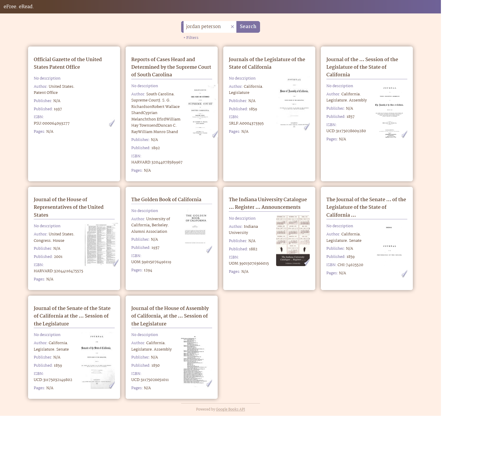

# eFree. eRead.

Search application for finding free eBooks (books and magazines) via Google Books API. Equipped with filtering options (number of results, publication type, sorting) that manipulate the query string.

## Table of contents

-   [Links](#links)
-   [Technologies](#technologies)
-   [Wokflow](#workflow)
-   [Sources](#sources)
-   [Screenshots](#screenshots)
-   [Author](#author)

## Links

-   [Live website](https://tkulic.github.io/ebooks-finder)
-   [GitHub repository](https://github.com/tkulic/ebooks-finder)

## Technologies

-   HTML5
-   CSS3
-   React JS library (functional componens & hooks)
-   [Google Books API](https://developers.google.com/books)

## Workflow

1. Project initialization as a public repository on GitHub
2. Planning out components structure and state management
3. Creating functional React components
4. Writing and testing stylsheet with placeholder data
5. Integrating Google Books IP into the script
6. Configuring repository to publish code with GitHub Pages

## Sources

-   Animated loader: [Remixicon](https://remixicon.com/)
-   [Google Books API](https://developers.google.com/books)

## Screenshots

## Author

-   GitHub profile - [Toni Kulić](https://github.com/tkulic)
